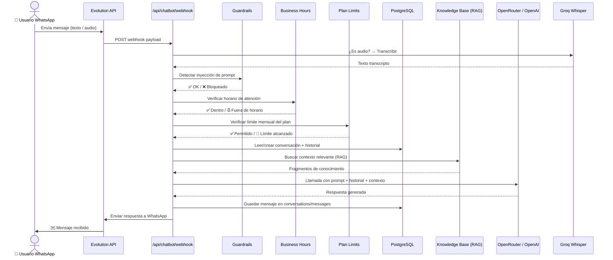
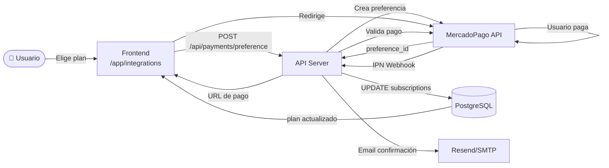
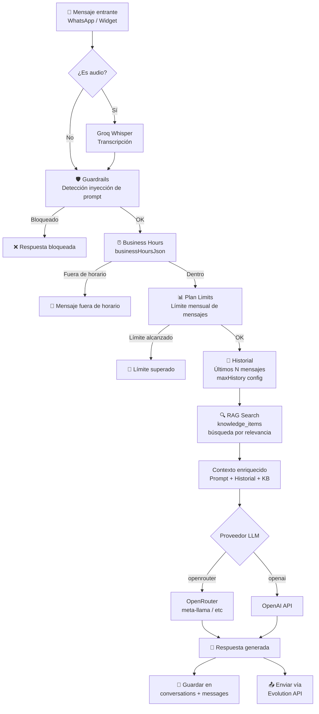

# Clientum — Análisis Completo del Proyecto
> Generado: 19 de Junio de 2026

---

## 1. Visión General

**Clientum** es una plataforma **SaaS multi-tenant** diseñada para PyMEs argentinas. Integra en un único dashboard:

- 🤖 **Chatbot de WhatsApp** con IA (RAG + LLMs)
- 🧾 **Facturación electrónica AFIP** (WSAA + WSFE)
- 📊 **CRM y gestión de leads**
- 🗓️ **Turnos y recordatorios automáticos**
- 🛍️ **Catálogo digital público**
- 💳 **Suscripciones vía MercadoPago**
- 🎯 **Prospector de leads** (Google Maps / OpenStreetMap)
- 🏭 **Provisioning de ERP** (Frappe)

---

## 2. Arquitectura del Monorepo

Gestión de dependencias con **pnpm workspaces**. TypeScript en toda la stack.

```
/
├── apps/
│   ├── api/          → Backend Express 5 (API REST + schedulers)
│   ├── web/          → Frontend React 19 + Vite 7 (dashboard)
│   └── mcp/          → Servidor MCP (Model Context Protocol)
├── packages/
│   ├── db/           → Schema PostgreSQL + migraciones (Drizzle ORM)
│   ├── api-spec/     → OpenAPI 3.0 (openapi.yaml)
│   ├── api-zod/      → Schemas Zod auto-generados (Orval)
│   ├── api-client-react/ → React Query hooks auto-generados
│   └── auth-web/     → Componentes de autenticación compartidos
├── scripts/          → CLI scripts (seed, import leads, create user)
├── proxy.mjs         → Proxy de entrada (API / Vite / Mockup)
└── start.sh          → Orquestador de todos los servicios
```

### Versiones clave (pnpm catalog)
| Tecnología | Versión |
|---|---|
| React | 19.1.0 |
| Vite | ^7.3.2 |
| Tailwind CSS | ^4.1.14 |
| Drizzle ORM | ^0.45.2 |
| Zod | 3.25.76 |
| Express | 5.x |

---

## 3. Backend — `apps/api`

### Tecnologías
- **Runtime**: Node.js + TypeScript
- **Framework**: Express 5
- **Logging**: Pino
- **Email**: Resend / SendGrid / SMTP
- **Sesiones**: Redis-backed (Replit infrastructure)
- **LLM**: OpenRouter + OpenAI
- **Audio**: Groq Whisper (transcripción de notas de voz)

### Middleware Global (`src/middlewares/`)

#### `authMiddleware.ts`
- Autenticación OIDC (Replit / Google) o Email+Password
- Inyecta `req.user` en cada request
- Refresh automático de tokens OIDC
- Enlazado de cuentas por email

#### `security.ts`
- **Helmet** con CSP + HSTS
- **CORS** separado: app principal vs. widget embebido
- **Rate Limiters** (6 capas):
  - `generalLimiter`
  - `authLimiter`
  - `webhookLimiter`
  - `widgetLimiter`
  - `adminLimiter`
  - `adminExecLimiter`

---

### Rutas API (`src/routes/`)

#### `/api/auth` — Autenticación
| Método | Endpoint | Descripción |
|---|---|---|
| GET | `/auth/user` | Devuelve el usuario autenticado o null |
| GET | `/login` | Inicio flujo OIDC |
| GET | `/callback` | Callback OIDC |
| GET | `/auth/google` | Inicio OAuth Google |
| GET | `/auth/google/callback` | Callback OAuth Google |
| POST | `/auth/register` | Registro con email/password |
| POST | `/auth/login-email` | Login con email/password |
| POST | `/auth/forgot-password` | Solicitud reset de contraseña |
| POST | `/auth/reset-password` | Aplicar nuevo password |
| POST | `/mobile-auth/token-exchange` | Intercambio de código OIDC para apps móviles |

**Lógica especial**: Al registrar un nuevo usuario se crea automáticamente una suscripción de prueba (plan `free`).

---

#### `/api/chatbot` — Chatbot & WhatsApp
| Método | Endpoint | Descripción |
|---|---|---|
| GET | `/chatbot/config` | Obtener configuración del agente IA |
| PUT | `/chatbot/config` | Actualizar configuración del agente IA |
| POST | `/chatbot/webhook` | **Webhook principal de WhatsApp** |
| POST | `/chatbot/evolution/*` | Proxied → Evolution API (QR, status, instancias) |

**Pipeline del webhook**:
1. Recibe mensaje de WhatsApp vía Evolution API
2. Transcribe audio con Groq/Whisper (si es nota de voz)
3. Detecta inyecciones de prompt (guardrails)
4. Verifica horarios de atención (`businessHoursJson`)
5. Controla límite mensual de mensajes por plan
6. Gestiona estado de conversación (handoff/activo)
7. Llama al LLM (OpenRouter/OpenAI) con contexto RAG
8. Responde vía Evolution API

---

#### `/api/leads` — CRM
| Método | Endpoint | Descripción |
|---|---|---|
| GET | `/leads` | Listar leads |
| POST | `/leads` | Crear lead |
| PATCH | `/leads/:id` | Actualizar lead |
| GET | `/leads/stats` | Estadísticas por etapa del funnel |
| GET | `/leads/export` | Exportar leads como CSV |

**Lógica especial**: Al mover un lead a etapa `propuesta` o `cerrado_ganado` se envía automáticamente una notificación por WhatsApp.

---

#### `/api/appointments` — Turnos
| Método | Endpoint | Descripción |
|---|---|---|
| GET | `/appointments` | Listar turnos |
| POST | `/appointments` | Crear turno |
| PATCH | `/appointments/:id` | Actualizar turno |

**Restricción**: Requiere plan `Starter` o superior.  
**Automatización**: Al crear un turno se programa un mensaje de recordatorio 24h antes en `scheduled_messages`.

---

#### `/api/afip` — Facturación Electrónica
| Método | Endpoint | Descripción |
|---|---|---|
| GET | `/afip/status` | Estado de configuración AFIP |
| POST | `/afip/configure` | Configurar CUIT + certificados digitales |
| POST | `/afip/solicitar-cae` | Emitir comprobante electrónico (WSFE) |
| POST | `/afip/refresh-token` | Renovar token AFIP (WSAA) |

**Servicios internos**:
- `lib/afip/wsaa.ts` → Autenticación con AFIP (PKCS#7 via node-forge)
- `lib/afip/wsfe.ts` → Emisión de facturas electrónicas (SOAP)

---

#### `/api/analytics` — Métricas
| Método | Endpoint | Descripción |
|---|---|---|
| GET | `/analytics` | Dashboard de métricas agregadas |

**Calcula**: tasa de conversión, tasa de resolución IA, funnel (Conversaciones → Interesados → Calificados).

---

#### `/api/admin` — Administración del Sistema
| Método | Endpoint | Descripción |
|---|---|---|
| GET | `/admin/users` | Gestión de usuarios y suscripciones |
| GET | `/admin/exec` (SSE) | Ejecución server-side de scripts de sistema |
| GET | `/admin/docs` | Lectura de documentación interna del filesystem |
| GET | `/admin/health-alerts` | Estado de salud del sistema + config de alertas WhatsApp |

---

### Servicios Background (`src/lib/`)

| Servicio | Frecuencia | Función |
|---|---|---|
| `reminderScheduler` | Cada 1 minuto | Envía recordatorios de turnos por WhatsApp |
| `afipTokenScheduler` | Cada 2 horas | Renueva tokens AFIP proactivamente |
| `healthAlerts` | Cada 3 minutos | Monitorea DB + Evolution API, alerta por WhatsApp |

### Otros servicios
- `lib/logger.ts` — Logging con Pino
- `lib/email.ts` — Envío de emails (auth, notificaciones)
- `lib/auth.ts` — Store de sesiones + config OIDC
- `lib/openrouter.ts` — Llamadas al LLM
- `lib/audio.ts` — Transcripción de audio (Whisper)
- `lib/phone.ts` — Normalización de números de teléfono

---

## 4. Frontend — `apps/web`

### Tecnologías
- **Framework**: React 19 + Vite 7
- **Router**: Wouter
- **Estado servidor**: TanStack React Query
- **UI Kit**: Shadcn/UI + Radix UI (25+ componentes)
- **Charts**: Recharts
- **Animaciones**: Framer Motion
- **Iconos**: Lucide React
- **Formularios**: React Hook Form
- **PDF**: jsPDF
- **CSV**: PapaParse

### Estructura de páginas (`src/pages/`)

#### Páginas Públicas
| Ruta | Componente | Descripción |
|---|---|---|
| `/` | `Home.tsx` | Landing page con secciones de marketing |
| `/auth` | `Auth.tsx` | Login + Registro |
| `/reset-password` | `ResetPassword.tsx` | Recuperación de contraseña |
| `/catalogo/:token` | `Catalogo.tsx` | Catálogo digital público del tenant |
| `/studio` | `Studio.tsx` | Landing de Creative Studio |
| `*` | `not-found.tsx` | 404 |

#### Dashboard (`/app/*`) — Protegido por auth
| Ruta | Componente | Descripción |
|---|---|---|
| `/app` | `Overview.tsx` | KPIs, actividad reciente, checklist de onboarding |
| `/app/agent` | `Agent.tsx` | Config del chatbot IA (prompt, modelo, WhatsApp) |
| `/app/analytics` | `Analytics.tsx` | Métricas de leads, conversiones y rendimiento |
| `/app/chat` | `Chat.tsx` | Simulador en tiempo real + trazas RAG |
| `/app/knowledge` | `Knowledge.tsx` | Base de conocimiento para RAG |
| `/app/crm` | `CRM.tsx` | Gestión de leads (pipeline Kanban/tabla) |
| `/app/prospector` | `Prospector.tsx` | Búsqueda de leads vía Google Maps |
| `/app/connect` | `ConnectWhatsApp.tsx` | Gestión de instancias Evolution API |
| `/app/flows` | `Flows.tsx` | Constructor de flujos de automatización |
| `/app/orders` | `Orders.tsx` | Pedidos capturados por el bot |
| `/app/appointments` | `Appointments.tsx` | Turnos y agenda |
| `/app/accounting` | `Accounting.tsx` | Facturas AFIP |
| `/app/finanzas` | `Finanzas.tsx` | Finanzas y pagos |
| `/app/erp` | `ERP.tsx` | Integración Frappe ERP |
| `/app/builder` | `Builder.tsx` | No-code app builder |
| `/app/forms` | `Forms.tsx` | Constructor de formularios |
| `/app/tables` | `Tables.tsx` | Tablas de datos |
| `/app/pages` | `Pages.tsx` | Constructor de páginas |
| `/app/admin` | `Admin.tsx` | Administración del sistema |
| `/app/monitor` | `SystemMonitor.tsx` | Monitor de infraestructura |

### Layout principal (`AppShell.tsx`)
- Sidebar colapsable con navegación agrupada
- Header con breadcrumbs, búsqueda, toggle de tema y centro de notificaciones
- Badges de conteo en tiempo real (handoffs pendientes, pedidos nuevos, etc.)
- Tema navy oscuro con tokens `@theme` CSS

### Hooks personalizados (`src/hooks/`)
| Hook | Función |
|---|---|
| `useTheme` | Modo oscuro/claro con persistencia en localStorage |
| `use-toast` | API imperativa para notificaciones (Sonner) |
| `use-mobile` | Detección de viewport móvil para layouts responsive |
| `useAuth` (packages/auth-web) | Polling de `/api/auth/user`, login/logout redirects |

---

## 5. Base de Datos — `packages/db`

### Tecnología: Drizzle ORM + PostgreSQL

### Esquema completo (22 tablas)

#### Auth
| Tabla | Columnas clave |
|---|---|
| `sessions` | `sid (PK)`, `sess (jsonb)`, `expire` |
| `users` | `id (PK)`, `email (unique)`, `firstName`, `lastName`, `passwordHash`, `role`, `createdAt` |
| `password_reset_tokens` | `token (PK)`, `userId (FK→users)`, `expiresAt`, `used` |

#### Suscripciones y Pagos
| Tabla | Columnas clave |
|---|---|
| `subscriptions` | `id`, `userId (FK, unique)`, `plan`, `status`, `mpPaymentId`, `mpPreferenceId`, `currentPeriodEnd` |
| `payment_events` | `id`, `userId (FK)`, `mpPaymentId`, `plan`, `amount`, `status`, `description`, `createdAt` |

#### Chatbot
| Tabla | Columnas clave |
|---|---|
| `chatbot_configs` | `id`, `userId (FK, unique)`, `evolutionApiUrl/Key/Instance`, `openrouterModel`, `systemPrompt`, `apiProvider`, `agentMode`, `maxHistory`, `widgetToken`, `guardrailsJson`, `businessHoursJson`, `groqApiKey`, `weeklyReportEnabled/Phone` |
| `conversations` | `id`, `userId (FK)`, `phoneNumber`, `contactName`, `channel`, `leadStatus`, `handoffMode`, `lastMessageAt`, `deletedAt` |
| `messages` | `id`, `conversationId (FK)`, `role`, `content`, `createdAt` |
| `knowledge_items` | `id`, `userId (FK)`, `title`, `content`, `createdAt` |

#### Catálogo
| Tabla | Columnas clave |
|---|---|
| `catalog_configs` | `id`, `userId (FK, unique)`, `token (unique)`, `brandName`, `primaryColor`, `logoUrl`, `whatsapp`, `featuresJson`, `faqJson`, `active` |

#### Automatización
| Tabla | Columnas clave |
|---|---|
| `flows` | `id`, `userId (FK)`, `name`, `active`, `triggerKeywords`, `matchType`, `nodes (jsonb)`, `priority`, `triggeredCount`, `resolvedCount` |
| `scheduled_messages` | `id`, `userId (FK)`, `phoneNumber`, `message`, `scheduledAt`, `sentAt`, `status`, `type` |

#### Servicios por Tenant
| Tabla | Columnas clave |
|---|---|
| `tenant_services` | `id`, `userId (FK)`, `serviceType`, `status`, `subdomain`, `siteUrl`, `requestedAt`, `provisionedAt` |

#### Turnos y Pedidos
| Tabla | Columnas clave |
|---|---|
| `appointments` | `id`, `userId (FK)`, `contactName`, `contactPhone`, `scheduledAt`, `durationMinutes`, `status`, `reminderSent` |
| `orders` | `id`, `userId (FK)`, `orderNumber`, `contactName`, `contactPhone`, `status`, `totalAmount`, `currency`, `channel` |
| `order_items` | `id`, `orderId (FK)`, `productName`, `quantity`, `unitPrice`, `totalPrice`, `metadata (jsonb)` |
| `order_status_history` | `id`, `orderId (FK)`, `fromStatus`, `toStatus`, `createdAt` |

#### AFIP
| Tabla | Columnas clave |
|---|---|
| `afip_configs` | `id (serial)`, `userId (unique)`, `cuit`, `razonSocial`, `puntoVenta`, `certPem`, `privateKeyPem`, `environment`, `token`, `sign`, `tokenExpiry` |
| `afip_comprobantes` | `id (serial)`, `userId`, `tipo`, `numero`, `puntoVenta`, `fecha`, `cae`, `impTotal`, `status` |

#### Newsletter
| Tabla | Columnas clave |
|---|---|
| `newsletter_subscribers` | `id`, `email (unique)`, `name`, `source`, `confirmed`, `unsubscribed`, `createdAt` |

#### Monitoreo
| Tabla | Columnas clave |
|---|---|
| `health_alert_logs` | `id`, `type`, `status`, `message`, `phone`, `sent`, `error`, `createdAt` |

---

## 6. Servidor MCP — `apps/mcp`

- Protocolo: **Model Context Protocol** (StreamableHTTP en `/mcp`)
- Permite que modelos de IA externos accedan a datos de Clientum
- Usa `@modelcontextprotocol/sdk` + `@workspace/db`
- Depende de `@workspace/db` directamente para queries

---

## 7. Packages Compartidos

### `packages/api-spec`
- OpenAPI 3.0 (`openapi.yaml`)
- Script `codegen` → ejecuta Orval para generar clientes

### `packages/api-zod`
- Schemas Zod auto-generados
- Shapes clave:
  - `AuthUser`: `{ id, email, firstName, lastName, role, profileImageUrl }`
  - `SessionData`: `{ user, access_token, refresh_token, expires_at }`
  - `HealthStatus`: `{ status: "ok"|"error", db: "connected"|"disconnected", ts }`

### `packages/api-client-react`
- Hooks React Query generados por Orval
- Consumidos por todas las páginas del dashboard

### `packages/auth-web`
- Hook `useAuth` compartido
- Maneja polling de sesión, login/logout redirects
- Basado en `@workspace/api-client-react`

---

## 8. Planes de Suscripción

| Plan | Descripción |
|---|---|
| `free` | Plan gratuito con límites básicos |
| `starter` | Incluye módulo de turnos |
| `pro` | Funcionalidades avanzadas |
| `business` | Sin límites, todas las integraciones |

Pagos procesados vía **MercadoPago** (preferencias + webhooks IPN).

---

## 9. Seguridad

- **Autenticación**: OIDC (Replit/Google) + Email/Password
- **Sesiones**: Redis-backed, auto-refresh de tokens
- **Headers**: Helmet (CSP, HSTS, X-Frame-Options, etc.)
- **Rate Limiting**: 6 capas diferenciadas por tipo de endpoint
- **CORS**: Configuraciones separadas para app y widget
- **Guardrails**: Detección de inyección de prompt en webhooks
- **Reset de contraseña**: Tokens con expiración + flag `used`

---

## 10. Integraciones Externas

| Integración | Uso |
|---|---|
| **Evolution API** | WhatsApp (envío/recepción de mensajes, QR, instancias) |
| **OpenRouter** | LLM gateway (meta-llama, etc.) |
| **OpenAI** | LLM alternativo |
| **Groq / Whisper** | Transcripción de notas de voz |
| **MercadoPago** | Suscripciones SaaS + pagos |
| **AFIP WSAA/WSFE** | Facturación electrónica argentina |
| **Google Maps / Places** | Búsqueda de leads (Prospector) |
| **OpenStreetMap** | Búsqueda de leads alternativa |
| **Frappe ERP** | Provisioning de instancias ERP por tenant |
| **SendGrid / Resend / SMTP** | Emails de sistema y autenticación |

---

## 11. Scripts de Utilidad (`scripts/`)

| Script | Descripción |
|---|---|
| `seed:admin` | Crear usuario administrador inicial |
| `import:leads` | Importar leads masivos desde archivo |
| `create:user` | Crear usuario manualmente |
| `hello` | Script de prueba de conexión |

---

## 12. Proxy y Orquestación

### `proxy.mjs`
Servidor proxy de entrada que enruta:
- `/api/*` → `apps/api` (Express)
- `/*` → `apps/web` (Vite dev server)
- `/mockup/*` → Mockup sandbox (Vite preview)

### `start.sh`
Orquesta el arranque simultáneo de todos los servicios del monorepo.

---

## 13. Convenciones y Decisiones Técnicas

- **Express 5**: `req.params` retorna `string|string[]` — siempre usar `String(req.params["name"])`
- **Wouter Link**: Nunca anidar `<a>` dentro de `<Link>`, usar `className` prop directamente
- **OpenRouter**: Usar cadena de fallback de modelos — los IDs viejos dan 404/rate-limit
- **Migraciones**: Usar el `pool` de `@workspace/db` en vez de crear un `pg.Pool` nuevo en `migrate.ts`
- **Tema**: Navy oscuro con tokens `@theme` CSS de Tailwind v4 en el AppShell
- **MCP**: StreamableHTTP montado en `/mcp`

---

## 14. Acceso Admin — Dev Login

### Credenciales del usuario administrador

| Campo | Valor |
|---|---|
| **ID** | `admin_clientum` |
| **Email** | `info@clientum.com.ar` |
| **Nombre** | Clientum Admin |
| **Role** | `admin` |
| **Plan** | Enterprise (activo) |
| **Widget Token** | `clientumadminwidgettoken00000001` |

### Cómo loguearse como admin (entorno de desarrollo)

**Paso 1** — Crear/recrear el usuario admin:
```bash
pnpm --filter @workspace/scripts run seed:admin
```

**Paso 2** — Asignar el rol `admin` en la DB (solo necesario la primera vez):
```sql
UPDATE users SET role = 'admin' WHERE id = 'admin_clientum';
```

**Paso 3** — Acceder sin contraseña vía dev-login:
```
/api/auth/dev-login
```
> Esta ruta solo funciona con `NODE_ENV=development`. En producción devuelve 404.

### Lógica de detección de admin

El frontend (`AppShell.tsx`) considera admin a un usuario si:
1. `user.role === "admin"` (campo en DB), **o**
2. El email termina en `@clientum.com.ar` (excepto `demo@clientum.com.ar`)

El backend (`guardAdmin` en `admin.ts`) solo acepta `role === "admin"` en la DB.

### Qué desbloquea el rol admin

- **Sidebar**: Link "Panel Admin" (ícono candado violeta) visible solo para admins
- **`/app/admin`**: Panel completo con 4 tabs:
  - **Usuarios**: tabla con todos los tenants, filtro por plan, cambio de plan y rol por usuario
  - **AFIP**: estado de tokens y certificados de todos los tenants
  - **Sistema**: terminal integrada con scripts de health/rebuild/backup
  - **Deploy**: guías de infraestructura y comandos de operación

### Gestión de usuarios desde el panel admin

Desde `/app/admin` → tab **Usuarios**:
- **Cambiar plan**: dropdown por fila con opciones `free / starter / pro / business / enterprise` — aplica inmediatamente vía `PATCH /api/admin/users/:id/plan`
- **Cambiar rol**: botón toggle por fila (User ↔ Admin) — aplica vía `PATCH /api/admin/users/:id/role`
- **Filtros**: búsqueda por email/nombre + filtro por plan
- **Métricas**: 6 KPI cards con distribución de planes en tiempo real

---

## 15. Diagramas de Arquitectura

### 15.1 — Arquitectura General del Sistema

```mermaid
graph TB
    subgraph Cliente["🌐 Cliente"]
        BR[Browser / App Web]
        WA[WhatsApp Usuario]
    end

    subgraph Proxy["⚡ Entrada — proxy.mjs"]
        PX{Proxy Router}
    end

    subgraph Frontend["🖥️ apps/web — React 19 + Vite"]
        LAND[Landing Page]
        AUTH[Auth Page]
        DASH[Dashboard /app/*]
        CAT[Catálogo Público]
    end

    subgraph Backend["🔧 apps/api — Express 5"]
        MW[Middleware: Auth + Security + Rate Limit]
        RT_AUTH[/api/auth]
        RT_CHAT[/api/chatbot]
        RT_LEADS[/api/leads]
        RT_APT[/api/appointments]
        RT_AFIP[/api/afip]
        RT_ANA[/api/analytics]
        RT_ADM[/api/admin]
    end

    subgraph MCP["🤖 apps/mcp — MCP Server"]
        MCPS[StreamableHTTP /mcp]
    end

    subgraph DB["🗄️ PostgreSQL — packages/db"]
        DBO[(Drizzle ORM)]
    end

    subgraph Externas["🔌 Integraciones Externas"]
        EVO[Evolution API\nWhatsApp]
        OR[OpenRouter\nLLMs]
        GROQ[Groq\nWhisper Audio]
        MP[MercadoPago\nPagos]
        AFIP_SVC[AFIP\nWSAA + WSFE]
        MAIL[Email\nResend/SMTP]
        MAPS[Google Maps\nProspector]
    end

    BR -->|HTTP| PX
    WA -->|Webhook| PX
    PX -->|"/*"| Frontend
    PX -->|"/api/*"| Backend
    PX -->|"/mcp"| MCP

    Backend --> MW
    MW --> RT_AUTH & RT_CHAT & RT_LEADS & RT_APT & RT_AFIP & RT_ANA & RT_ADM

    Backend --> DBO
    MCP --> DBO

    RT_CHAT <-->|Mensajes| EVO
    RT_CHAT -->|LLM calls| OR
    RT_CHAT -->|Transcripción| GROQ
    RT_AFIP <-->|SOAP| AFIP_SVC
    RT_AUTH -->|Emails| MAIL
    Backend -->|Webhooks IPN| MP
    DASH -->|Búsqueda| MAPS
```

---

### 15.2 — Flujo del Webhook de WhatsApp



---

### 15.3 — Entidades de Base de Datos (ERD)

```mermaid
erDiagram
    users {
        varchar id PK
        varchar email UK
        varchar firstName
        varchar lastName
        varchar passwordHash
        varchar role
        timestamp createdAt
    }

    sessions {
        varchar sid PK
        jsonb sess
        timestamp expire
    }

    subscriptions {
        varchar id PK
        varchar userId FK
        text plan
        text status
        varchar mpPaymentId
        timestamp currentPeriodEnd
    }

    payment_events {
        varchar id PK
        varchar userId FK
        varchar mpPaymentId
        text plan
        integer amount
        text status
    }

    chatbot_configs {
        varchar id PK
        varchar userId FK
        text evolutionApiUrl
        text openrouterModel
        text systemPrompt
        text apiProvider
        text guardrailsJson
        text businessHoursJson
        varchar widgetToken UK
    }

    conversations {
        varchar id PK
        varchar userId FK
        varchar phoneNumber
        varchar contactName
        text leadStatus
        boolean handoffMode
        timestamp lastMessageAt
    }

    messages {
        varchar id PK
        varchar conversationId FK
        text role
        text content
        timestamp createdAt
    }

    knowledge_items {
        varchar id PK
        varchar userId FK
        text title
        text content
    }

    flows {
        varchar id PK
        varchar userId FK
        varchar name
        boolean active
        text triggerKeywords
        jsonb nodes
        integer priority
    }

    appointments {
        varchar id PK
        varchar userId FK
        varchar contactName
        varchar contactPhone
        timestamp scheduledAt
        text status
        boolean reminderSent
    }

    scheduled_messages {
        varchar id PK
        varchar userId FK
        varchar phoneNumber
        text message
        timestamp scheduledAt
        text status
        text type
    }

    orders {
        varchar id PK
        varchar userId FK
        varchar orderNumber
        text status
        integer totalAmount
        varchar currency
    }

    order_items {
        varchar id PK
        varchar orderId FK
        varchar productName
        integer quantity
        integer unitPrice
    }

    afip_configs {
        serial id PK
        text userId UK
        text cuit
        text razonSocial
        integer puntoVenta
        text environment
        timestamp tokenExpiry
    }

    afip_comprobantes {
        serial id PK
        text userId
        integer tipo
        integer numero
        text cae
        numeric impTotal
    }

    catalog_configs {
        varchar id PK
        varchar userId FK
        varchar token UK
        text brandName
        boolean active
    }

    health_alert_logs {
        varchar id PK
        text type
        text status
        text message
        boolean sent
    }

    users ||--o{ subscriptions : "tiene"
    users ||--o{ payment_events : "genera"
    users ||--|| chatbot_configs : "configura"
    users ||--o{ conversations : "recibe"
    users ||--o{ knowledge_items : "entrena"
    users ||--o{ flows : "define"
    users ||--o{ appointments : "agenda"
    users ||--o{ scheduled_messages : "programa"
    users ||--o{ orders : "recibe"
    users ||--|| afip_configs : "configura"
    users ||--|| catalog_configs : "publica"
    conversations ||--o{ messages : "contiene"
    orders ||--o{ order_items : "incluye"
    appointments ||--o{ scheduled_messages : "genera"
```



---

### 15.4 — Flujo de Suscripción (MercadoPago)



---

### 15.5 — Arquitectura del Frontend (Rutas y Layouts)

```mermaid
graph TD
    ROOT[App.tsx\nQueryClient + Providers]

    ROOT --> PUBLIC[PublicLayout]
    ROOT --> PROTECTED[AppShell\nSidebar + Header]

    PUBLIC --> HOME[/ — Home Landing]
    PUBLIC --> AUTHP[/auth — Login/Registro]
    PUBLIC --> RESET[/reset-password]
    PUBLIC --> CAT[/catalogo/:token — Catálogo Público]
    PUBLIC --> STUDIO[/studio]

    PROTECTED --> OV[/app — Overview\nKPIs + Onboarding]
    PROTECTED --> AGENT[/app/agent\nConfig Chatbot IA]
    PROTECTED --> ANA[/app/analytics\nMétricas y Funnel]
    PROTECTED --> CHAT[/app/chat\nSimulador + RAG Trace]
    PROTECTED --> KNOW[/app/knowledge\nBase de Conocimiento]
    PROTECTED --> CRM[/app/crm\nPipeline de Leads]
    PROTECTED --> PROSP[/app/prospector\nBúsqueda Google Maps]
    PROTECTED --> CONN[/app/connect\nWhatsApp Instancias]
    PROTECTED --> FLOWS[/app/flows\nAutomatizaciones]
    PROTECTED --> ORD[/app/orders\nPedidos]
    PROTECTED --> APT[/app/appointments\nTurnos]
    PROTECTED --> ACC[/app/accounting\nAFIP Facturas]
    PROTECTED --> FIN[/app/finanzas\nFinanzas]
    PROTECTED --> ERP[/app/erp\nFrappe ERP]
    PROTECTED --> ADM[/app/admin\nAdministración]
    PROTECTED --> MON[/app/monitor\nMonitor Sistema]
```

---

### 15.6 — Pipeline de IA y RAG



---

*Documento generado automáticamente analizando la totalidad del código fuente del proyecto Clientum.*
